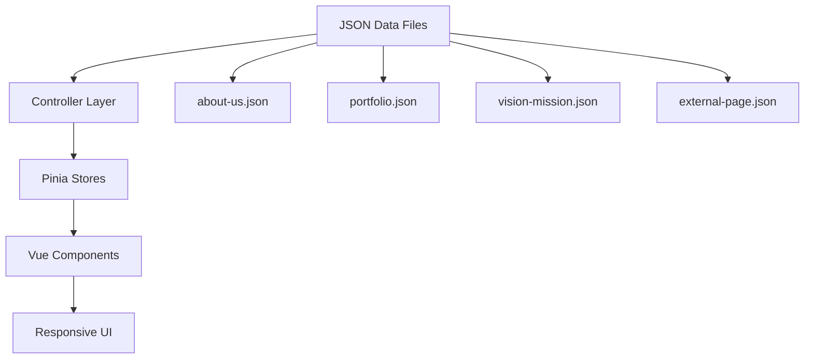

# ⚡ ThunderStack - Gaming Studio Portfolio

<div align="center">


### � **Cultural Gaming Excellence Portfolio**

*Modern gaming studio portfolio showcasing cultural gaming experiences with Vue 3 + Vuetify*

[](https://vercel.com/new/clone?repository-url=https://github.com/centmarde/thunder-stack-studio-portfolio)

</div>

---

## ✨ **What Makes ThunderStack Special?**

ThunderStack is a modern gaming studio portfolio built with Vue 3 and Vuetify, featuring a **data-driven architecture** that showcases cultural gaming experiences. The application emphasizes responsive design, smooth animations, and professional gaming industry presentation.

### 🎮 **Key Features**
- **🎯 Fixed Navigation**: Always-visible navbar with smooth scrolling to sections
- **🎨 Modern UI**: Clean Vuetify Material Design components
- **📱 Responsive Design**: Optimized for mobile, tablet, and desktop
- **🌙 Theme Support**: Light/Dark mode toggle with persistent preferences
- **🎭 Cultural Focus**: Highlighting cultural gaming excellence and innovation
- **⚡ Performance**: Fast loading with Vite build optimization

### 🏗️ **Modular Component Architecture**
```typescript
// Smart Layout Wrappers
OuterLayoutWrapper  // Public pages (Landing, Portfolio)
InnerLayoutWrapper  // Authenticated pages (Admin, Dashboard)

// Navigation Variants
OuterNavbar1-4     // Different navbar styles for public pages
InnerNavbar1-4     // Admin/Dashboard navigation variants
```

---

## 🛠️ **Tech Stack & Architecture**

<table>
<tr>
<td width="50%">

### **Frontend Core**
- **🖼️ Vue 3** - Composition API with `<script setup>`
- **🎨 Vuetify 3** - Material Design components **(Styling-Only)**
- **📘 TypeScript** - Full type safety with strict config
- **⚡ Vite** - Lightning-fast dev server & builds
- **🍍 Pinia** - Intuitive state management

</td>
<td width="50%">

### **Backend & Services**
- **🚀 Supabase** - Authentication & Database
- **🌐 Axios** - HTTP client for data fetching
- **🔄 Vue Router 4** - File-based auto-routing
- **🎭 Vue Toastification** - Elegant notifications
- **📋 Auto-imports** - Zero-import development

</td>
</tr>
</table>

### **🤖 Development Automation**
| Plugin | Purpose | Auto-Generated |
|--------|---------|----------------|
| `unplugin-vue-router` | 📁 **File-based routing** | Routes from `src/pages/*.vue` |
| `unplugin-vue-components` | 🔧 **Auto-importing** | Global components from `src/components/` |
| `vite-plugin-vue-layouts-next` | 📐 **Layout system** | Layout wrappers from `src/layouts/` |
| `unplugin-auto-import` | ⚡ **Composables** | Vue/Pinia/Router APIs without imports |
| `unplugin-fonts` | 🔤 **Typography** | Google Fonts auto-loading |

### **🎮 Gaming Portfolio Features**
- **🏠 Landing Page**: Hero section with gaming studio introduction
- **🎯 Vision & Mission**: Cultural gaming philosophy showcase
- **👥 About Us**: Team presentation and studio background
- **💼 Portfolio**: Games and projects gallery
- **🔐 Admin Panel**: Content management system
- **📊 User Management**: Role-based access control

---

## 🏗️ **ThunderStack Architecture**

### **JSON-Driven Content Management**


### **Controller Pattern for Data Management**
```typescript
// src/controller/landingController.ts
export function useLandingController() {
  const data = ref<LandingData | null>(null)
  const loading = ref(false)
  const error = ref<string | null>(null)
  
  const fetchLandingData = async () => {
    const response = await axios.get<LandingData>('/data/external-page.json')
    data.value = response.data
  }
  
  return { data, loading, error, fetchLandingData }
}
```

### **Navigation System**
- **OuterNavbar3**: Fixed position navbar with smooth scrolling
- **Mobile Drawer**: Responsive navigation for mobile devices
- **Theme Toggle**: Persistent light/dark mode switching
- **Scroll Animations**: Dynamic navbar behavior based on scroll position

---

## 🚀 **Quick Start**

### **Prerequisites**
- Node.js 18+ 
- npm/yarn/pnpm

### **Installation**
```bash
# Clone the repository
git clone https://github.com/centmarde/thunder-stack-studio-portfolio.git
cd ThunderStack

# Install dependencies
npm install

# Start development server
npm run dev

# Build for production
npm run build
```

### **Customize Your Gaming Portfolio**
1. **📝 Content Management**: Update JSON files in `public/data/`
   - `about-us.json` - Team and studio information
   - `portfolio.json` - Games and projects showcase
   - `vision-mission.json` - Studio philosophy and goals
   - `external-page.json` - Landing page configuration

2. **🎨 Branding**: Modify theme colors and logo in configurations
3. **📄 Add Pages**: Create `.vue` files in `src/pages/` (auto-routed)
4. **🧩 Components**: Add custom components in `src/components/`

---

## 📁 **Project Structure**

```
src/
├── 📱 components/
│   ├── auth/              # Authentication forms & modals
│   ├── common/           # Shared UI components
│   │   ├── outerNavbars/ # Public navigation variants
│   │   ├── insideNavbar/ # Admin navigation variants
│   │   ├── outerFooters/ # Public page footers
│   │   └── sideBar/      # Admin sidebar navigation
│   └── admin/            # Admin panel components
├── 🎛️ controller/        # Data fetching & state management
├── 📄 pages/             # Auto-routed page components
│   ├── admin/            # Admin panel pages
│   ├── hometab/          # Home dashboard tabs
│   └── otherTab/         # Additional feature tabs
├── 🗃️ stores/            # Pinia state stores
├── 🎨 layouts/           # Layout wrapper components
├── 🔧 plugins/           # Vue plugin configurations
├── 📚 lib/               # Supabase & utility libraries
├── 🎯 composables/       # Vue composables (useTheme)
└── 🎨 themes/            # Vuetify theme configurations

public/
└── 📊 data/
    ├── about-us.json        # Team & studio info
    ├── portfolio.json       # Games & projects
    ├── vision-mission.json  # Studio philosophy
    └── external-page.json   # 🎯 Landing page config
```

---

## 💡 **ThunderStack Philosophy**

### **� Gaming-First Design**
- **Cultural Focus**: Emphasizing cultural gaming excellence
- **Professional Showcase**: Industry-standard portfolio presentation
- **User Experience**: Smooth animations and intuitive navigation

### **🎨 Modern Vue 3 Patterns**
- **Composition API**: `<script setup>` syntax throughout
- **TypeScript**: Full type safety and developer experience
- **Auto-imports**: Zero-import development workflow
- **Responsive Design**: Mobile-first, progressive enhancement

### **� Performance Optimized**
- **Fixed Navigation**: Always-accessible navigation with smooth scrolling
- **Lazy Loading**: Components and routes loaded on demand
- **Modern Build**: Vite-powered development and production builds
- **Theme Persistence**: User preferences saved across sessions

### **🎯 Key UI Features**
- **Fixed Navbar**: `OuterNavbar3` with always-visible positioning
- **Theme Toggle**: Light/Dark mode with smooth transitions
- **Responsive Mobile Menu**: Collapsible navigation drawer
- **Smooth Scrolling**: Anchor-based navigation within pages

---

## 🤝 **Contributing to ThunderStack**

We welcome contributions to improve the ThunderStack gaming portfolio template! This project serves as a foundation for gaming studios to showcase their work professionally.

### **Project Goals**
- **🎮 Gaming Industry Focus**: Tailored for gaming studios and developers
- **📱 Cross-Platform Ready**: Web, PWA, and mobile deployment
- **🎨 Modern Design**: Contemporary UI patterns and animations
- **📈 Performance First**: Optimized loading and user experience

### **Contribution Areas**
- � **Gaming Components**: Specialized components for game showcases
- 🎨 **UI/UX Improvements**: Enhanced visual design and interactions
- 📊 **Content Management**: Better JSON schema for portfolio data
- 🔌 **Integrations**: Gaming platform APIs (Steam, itch.io, etc.)
- 📱 **Mobile Experience**: Touch-optimized interactions
- � **Documentation**: Setup guides and customization examples

### **Recent Updates**
- ✅ **Fixed Navigation**: Implemented always-visible navbar with smooth scrolling
- ✅ **Theme System**: Added persistent light/dark mode toggle
- ✅ **Mobile Responsive**: Optimized navigation drawer and mobile experience

---

## 📄 **License**

This project is open source and available under the [MIT License](LICENSE).

---

<div align="center">

**� Star this repo if ThunderStack powers your gaming portfolio!**

[🐛 Report Bug](https://github.com/centmarde/thunder-stack-studio-portfolio/issues) • [💡 Request Feature](https://github.com/centmarde/thunder-stack-studio-portfolio/issues) • [💬 Discussions](https://github.com/centmarde/thunder-stack-studio-portfolio/discussions)

### 🚀 **Ready to showcase your games?**

ThunderStack provides everything you need to create a professional gaming studio portfolio with modern web technologies.

</div>